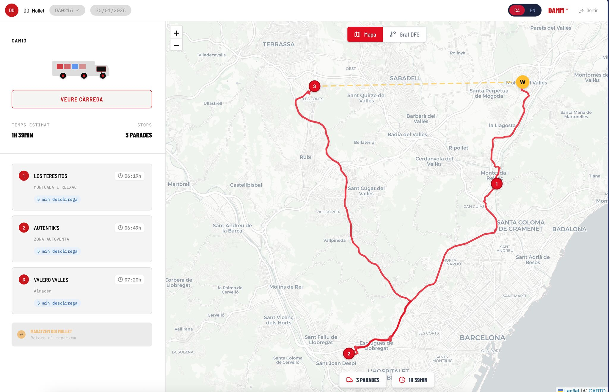
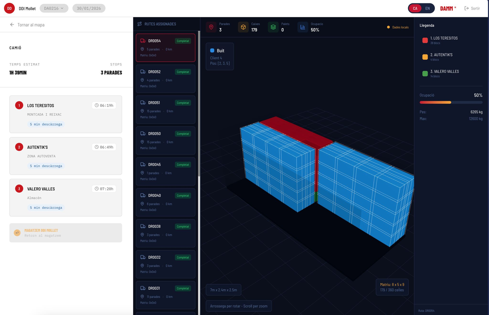
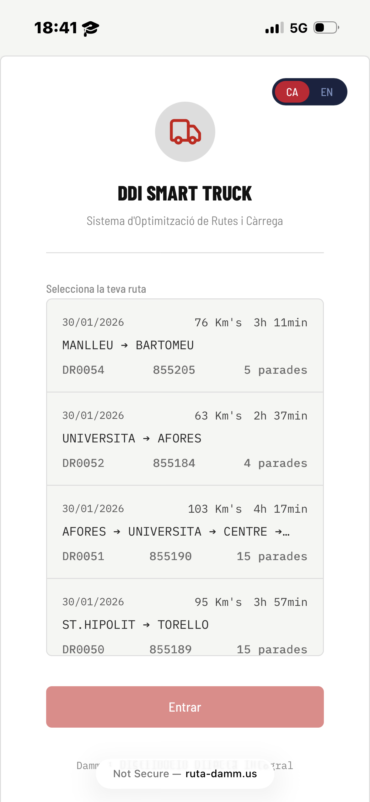
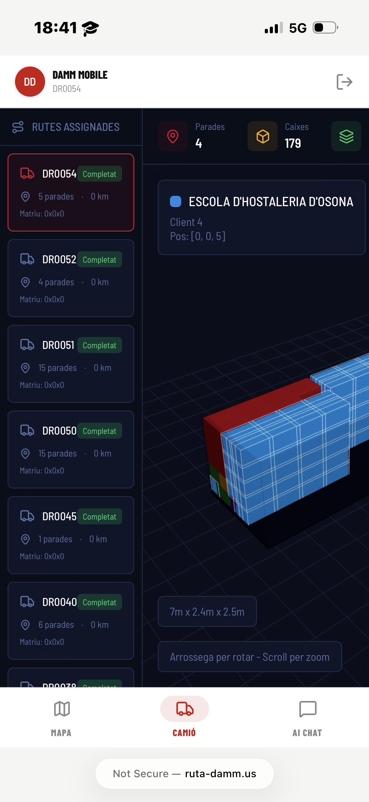
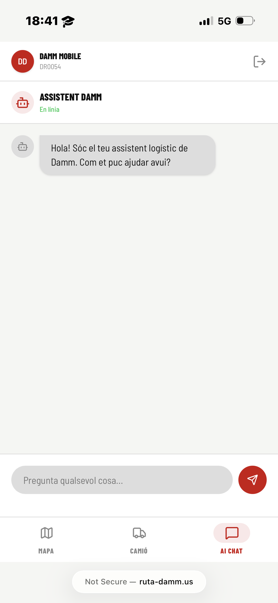

#   Ruta Damm 

> **From warehouse to street — the perfect route and a loaded truck in seconds.**

🏆 **Winner** — Best MongoDB Implementation · MLH · Interhack BCN 2026

Ruta Damm is a logistics optimization prototype built during **Interhack BCN 2026** for Damm's DDI distribution network. It jointly optimizes delivery routes and truck cargo configuration, reducing unloading time, minimizing kilometers, and handling reverse logistics — all in one unified pipeline.

---

## What it does

| Module | Description |
|---|---|
| **Route Optimizer** | VRPTW via OR-Tools — optimal visit order respecting time windows, real travel times, and proximity clustering |
| **Truck Loader** | 3D pallet assembly in reverse delivery order — first stop at the back, last stop at the front |
| **Reverse Logistics** | Tracks returnable crates, bottles, and kegs collected during the route |
| **Web Interface** | Next.js dashboard with interactive Leaflet map, stop timeline, and cargo plan visualization |

---

## Screenshots

### Desktop View (Routes & Cargo)
<table>
  <tr>
    <td></td>
    <td></td>
  </tr>
</table>

### Mobile View (Driver App Example)
<table>
  <tr>
    <td></td>
    <td></td>
    <td></td>
  </tr>
</table>

---

## Architecture

```
damm-router/
├── main.py                        # Orchestrates the full pipeline
├── ARQUITECTURA.md                # Technical design document
├── BD/                            # Input Excel files (hackathon data)
├── src/
│   ├── alghoritms/
│   │   ├── router.py              # Route optimizer (public API: executar_ruta)
│   │   └── truck_loader.py        # Pallet generator & truck assembly
│   ├── utils/
│   │   └── carga_async.py         # Async API → generates cargo & saves to MongoDB
│   └── db/
│       ├── excel_to_sql.py        # Excel → SQLite (prototyping)
│       └── mongo.py               # MongoDB connector
├── web/                           # Next.js frontend (React + Leaflet)
│   └── ...
└── test_carga.py / test_truck_loader.py
```

**Data flow:**

```
Excel (Hackaton.xlsx + Horarios.xlsx + ZM040.xlsx)
  → MongoDB (detalle_entrega, horarios_entrega)
    → router.py  →  ruta_optima.json + ruta_damm.html
    → truck_loader.py  →  resultado_carga_camion (MongoDB)
      → Next.js web  →  interactive dashboard
```

---

## Quickstart

### Python backend

```bash
# 1. Create virtual environment
python -m venv .venv
source .venv/bin/activate          # Windows: .venv\Scripts\activate

# 2. Install dependencies
pip install ortools pandas numpy geopy folium certifi requests pymongo

# 3. Load data & run full pipeline
python main.py
```

### Run a single route

```bash
python src/alghoritms/router.py --ruta DR0006 --data 19/03/2026 --dia 4 --html
```

Or from Python:

```python
from src.alghoritms.router import executar_ruta
executar_ruta('DR0006', '19/03/2026', dia=4, exportar_html=True)
```

### Generate truck cargo plan

```bash
python src/test_carga.py
```

Or from an async context:

```python
from src.utils.carga_async import generar_carga
await generar_carga(id_ruta, ids_parada)
```

### Web frontend

```bash
cd web
npm install        # or: pnpm install
npm run dev
```

---

## Inputs & Outputs

**Inputs** (MongoDB collections loaded from Excel):
- `detalle_entrega` — orders per stop (client, products, quantities)
- `horarios_entrega` — time windows per client

**Outputs:**
- `ruta_optima.json` — optimized route with stop order and estimated times
- `ruta_damm.html` — interactive Folium map
- MongoDB `ruta_punts` — individual stop data
- MongoDB `ruta_resum` — route-level summary
- MongoDB `resultado_carga_camion` — truck cargo matrix

---

## Requirements

- Python 3.10+
- Node.js (version in `web/package.json`) + npm or pnpm
- MongoDB instance (local or Atlas)
- Internet access for Nominatim geocoding and OSRM routing

> **Note on OSRM:** The public API (`router.project-osrm.org`) has rate limits. For high-volume use, deploy a local OSRM instance or substitute another routing provider.

---

## Key assumptions & tunable constants

Inside `src/alghoritms/router.py` you'll find constants that can be adjusted:

- **Traffic factor per time slot** — multiplier applied to base travel times
- **Unloading duration** — estimated minutes per stop based on box count
- **Max route duration** — working day length cap
- **Clustering threshold** — distance (m) below which two stops are merged into one

---

## Built with

`OR-Tools` · `geopy / Nominatim` · `OSRM` · `Folium` · `pandas` · `pymongo` · `Next.js` · `React` · `Leaflet`

---

## License

See `LICENSE`.
